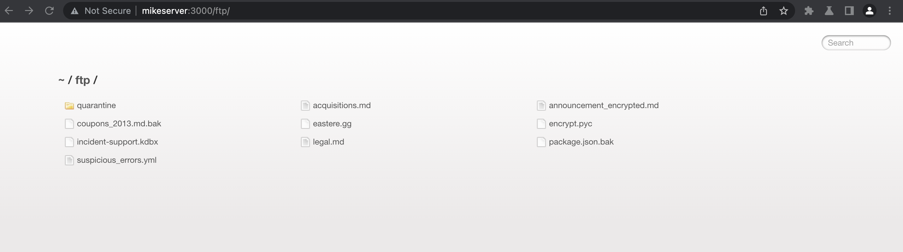
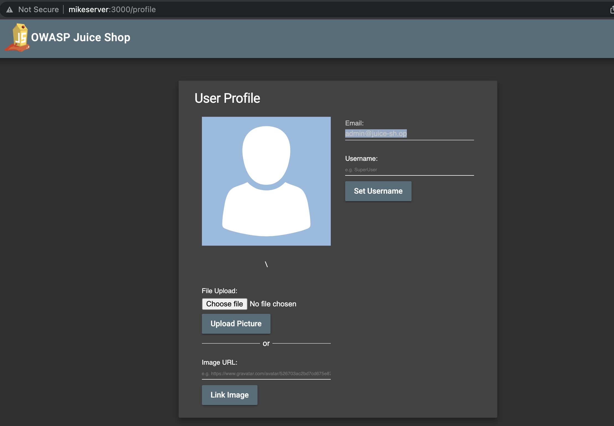
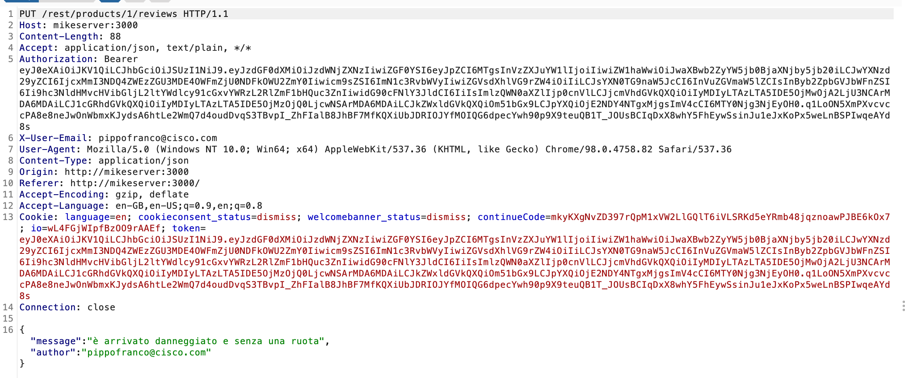
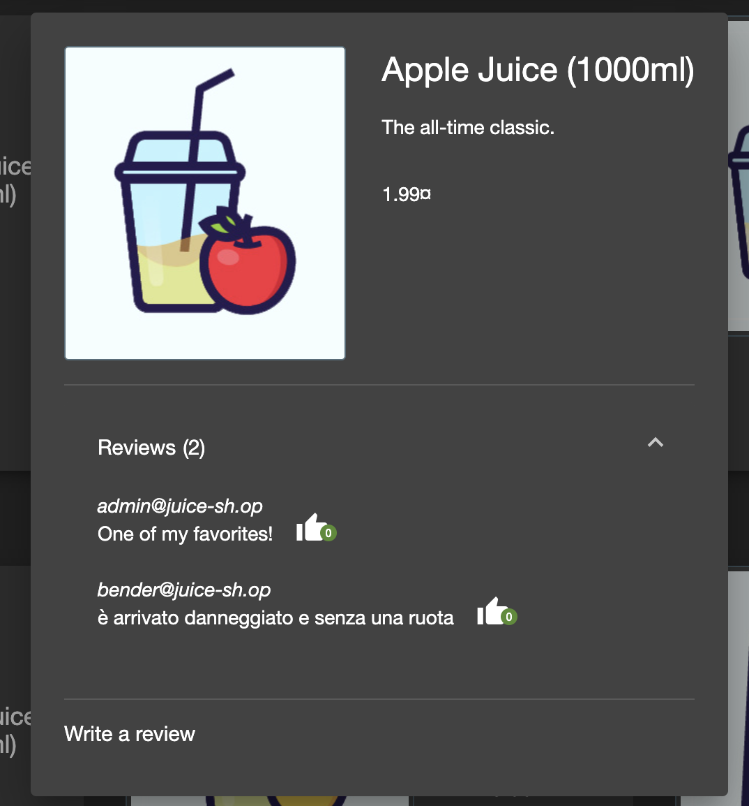
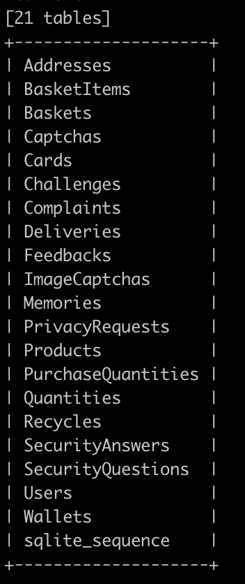

# Summary
* [XSS: iframe](#xss_iframe)
* [Sensitive Data Exposure: robots.txt](#robots_txt)
* [SQL Injection: 'OR true--](#sql_injection_1)
* [Weak password: admin admin](#weak_pwd)
* [Broken access control: bender's review](#bender_review)
* [SQL Injection: --dump-all](#sql_injection_whole)


# Vulnerabilities

## XSS: *iframe* <a name="xss_iframe"></a>
### Description
La barra di ricerca nella pagina principale è vulnerabile agli xss usando gli iframe
### Proof of Concept 
Scrivere il seguente payload nella barra di ricerca
```javascript
<iframe src="javascript:alert(`xss`)">
```
### Risk assessment
### Mitigation

## Server misconfiguration: *robots.txt* <a name="robots_txt"></a>
### Description
E' possibile accedere al file robots.txt, il quale restituisce il seguente output:
```
User-agent: *
Disallow: /ftp
```
Andando nella cartella /ftp è possibile accedere a diversi file

### Proof of Concept
Andare all'url /robots.txt \
Andare all'url /ftp
### Risk assessment
### Mitigation

## Sql Injection: *'OR true--* <a name="sql_injection_1"></a>
### Description
E' possibile autenticarsi come admin sfruttando una sql injection 
nella pagina di login. 
### Proof of concept
Andare all'url /#/login
scrivere nel campo email 
```
'OR true--
```
Andando su /profile si vede che si è stati autenticati come admin,
con email admin@juice-sh.op.

### Risk Assessment
### Mitigation

## Weak password: admin admin <a name="weak_pwd"></a>
### Description
E' possibile trovare facilmente la mail dell'admin leggendo tra le recensioni dei
prodotti.
Facendo qualche tentativo sono riuscito ad autenticarmi come admin indovinando la password
### POC
* leggendo le recensioni di *Apple juice (1000 ml)*, si trova la mail admin@juice-sh.op
* Loggarsi con la password *admin123*
### Risk Assessment
### Mitigation

## Broken access control: bender's review <a name="bender_review"></a>
### Description
E' possibile scrivere una recensione di un prodotto a nome di un altro utente 
### POC
Ho prima effettuato l'ordine di un prodotto. Poi andando su 
Account > Orders and Payments > Order history
è possibile scrivere una review per uno dei prodotti acquistati.
Ho scritto la review e ho intercettato la richiesta

e prima di inviarla ho modificato nel body il campo *author* inserendo la mail di un altro utente,
ovvero bender@juice-sh.op. Risultato:

### Risk assessment
### Mitigation

## SQL Injection: dump whole db <a name="sql_injection_whole"></a>
L'endpoint */rest/products/search?q=\** per la ricerca dei prodotti è vulnerabile alle boolean-based blind sql injections.
E' possibile ottenere il dump di tutte le tabelle del db. L'attacco è stato condotto sfruttando 
il tool automatico *sqlmap.py*, passando come input  catturata con Burp.
### POC 
* Per ottenere il tipo di dbms: \
    `python sqlmap.py -r request.txt --level=5 risk=3 --banner` \
    Il DBMS è SQLite
* Per ottenere la lista delle tabelle: \
    `python sqlmap.py -r request.txt --level=5 risk=3 --dbms=SQLITE --tables` \
    
* Per ottenere la tabella Users: \
    `python sqlmap.py -r request.txt --level=5 risk=3 --banner --ignore-code 401 -T Users --dbms=SQLITE -dump` \
    File CSV contenente la tabella Users: 
### Risk Assessment
### Mitigation


