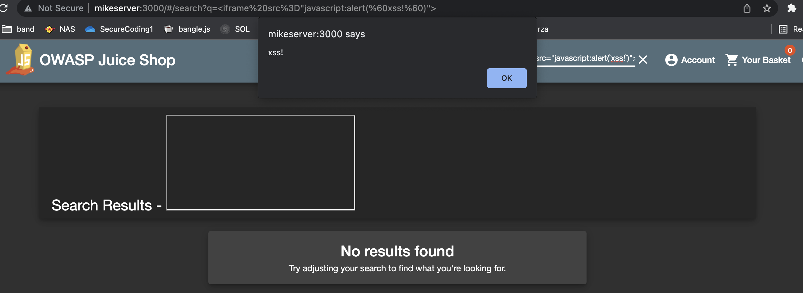
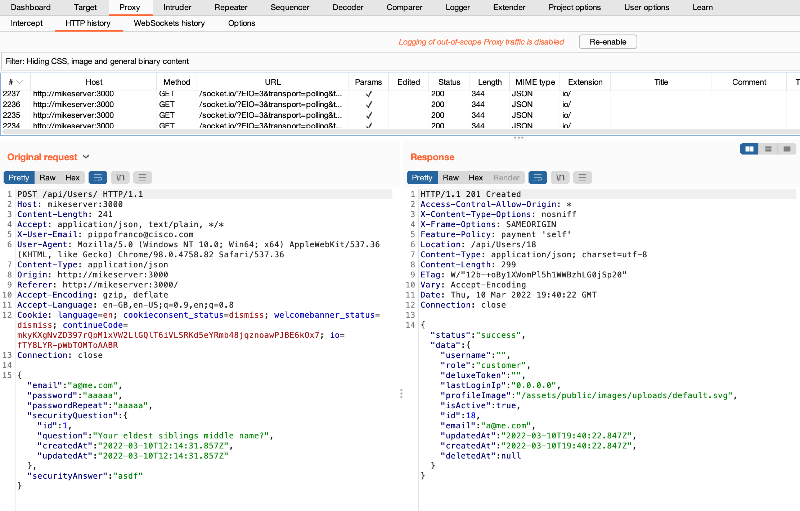
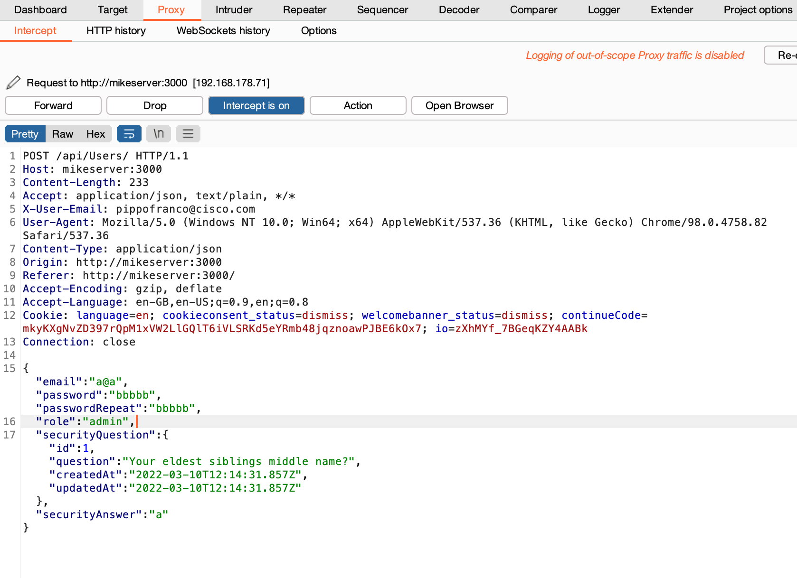
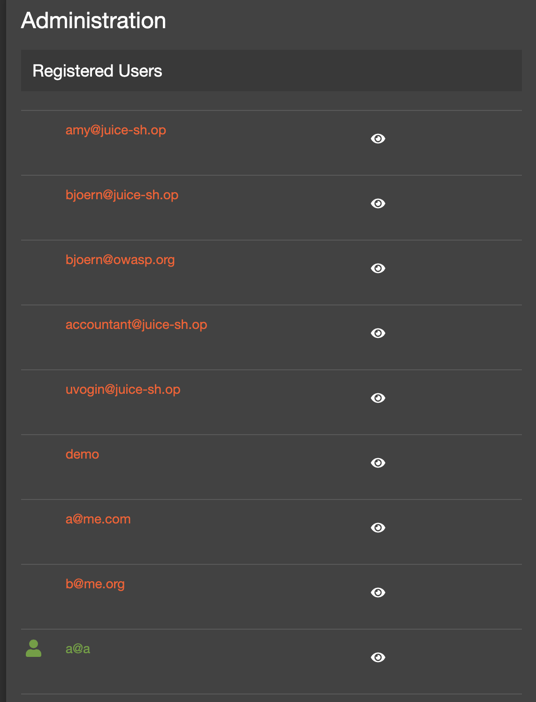

# Summary

**Vulnerabilità**

* [XSS: iframe](#xss_iframe)
* [Sensitive Data Exposure: robots.txt](#robots_txt)
* [SQL Injection: 'OR true--](#sql_injection_1)
* [Weak password: admin admin](#weak_pwd)
* [Broken access control: bender's review](#bender_review)
* [SQL Injection: --dump-all](#sql_injection_whole)
* [Improper input validation: register as admin](#input_validation_admin)

[Note sulla Risk Rating Methodology adottata](#risk_rating_notes)
# Vulnerabilities

## XSS: *iframe* <a name="xss_iframe"></a>
### Description
La barra di ricerca nella pagina principale è vulnerabile agli xss usando gli iframe



### Proof of Concept 
Scrivere il seguente payload nella barra di ricerca
```javascript
<iframe src="javascript:alert(`xss`)">
```
### Risk assessment
**Likelihood**

|   | Skill Level   | Opportunity   | Ease of Discovery   | Ease of Exploit   | Mean   | Label   |
|---|:-------------:|:-------------:|:-------------------:|:-----------------:|:------:|:-------:|
|   |       9       |        9      |          9          |          9        |   9    |    HIGH |

**Impact**

|   | Loss of Confidentiality   | Loss of Integrity   | Financial Damage   | Privacy Violation   | Mean   | Label |
|---|:-------------------------:|:-------------------:|:------------------:|:-------------------:|:------:|:-----:|
|   |                6          |          1          |         2          |          7          |   4    | MEDIUM|

**Risk** **HIGH**

|        |        | RISK   |              |        |
|--------|--------|:------:|:------------:|:------:|
|        | HIGH   |        |              |        |
|Impact  | MEDIUM |        |              |    X   |
|        | LOW    |        |              |        |
|        |        | LOW    | MEDIUM       | HIGH   |
|        |        |        | Likelihood   |        |


## Server misconfiguration: *robots.txt* <a name="robots_txt"></a>
### Description
E' possibile accedere al file robots.txt, il quale restituisce il seguente output:
```
User-agent: *
Disallow: /ftp
```
Andando nella cartella /ftp è possibile accedere a diversi file


### Proof of Concept
Andare all'url /robots.txt \
Andare all'url /ftp
### Risk assessment
**Likelihood**

|   | Skill Level   | Opportunity   | Ease of Discovery   | Ease of Exploit   | Mean   | Label   |
|---|:-------------:|:-------------:|:-------------------:|:-----------------:|:------:|:-------:|
|   |        9      |        9      |         9           |         9         |    9   |   HIGH  |

**Impact**

|   | Loss of Confidentiality   | Loss of Integrity   | Financial Damage   | Privacy Violation   | Mean   | Label |
|---|:-------------------------:|:-------------------:|:------------------:|:-------------------:|:------:|:-----:|
|   |             7              |         2            |         5           |          2           |  4      |   MEDIUM    |

**Risk** **HIGH** 

|        |        | RISK   |              |        |
|--------|--------|:------:|:------------:|:------:|
|        | HIGH   |        |              |        |
|Impact  | MEDIUM |        |              |    X    |
|        | LOW    |        |              |        |
|        |        | LOW    | MEDIUM       | HIGH   |
|        |        |        | Likelihood   |        |


## Sql Injection: *'OR true--* <a name="sql_injection_1"></a>
### Description
E' possibile autenticarsi come admin sfruttando una sql injection 
nella pagina di login. 
### Proof of concept
Andare all'url /#/login
scrivere nel campo email 
```
'OR true--
```
Andando su /profile si vede che si è stati autenticati come admin,
con email admin@juice-sh.op.


### Risk Assessment
**Likelihood**

|   | Skill Level   | Opportunity   | Ease of Discovery   | Ease of Exploit   | Mean   | Label   |
|---|:-------------:|:-------------:|:-------------------:|:-----------------:|:------:|:-------:|
|   |        9       |        9       |         9            |          9         |    9    |     HIGH    |

**Impact**

|   | Loss of Confidentiality   | Loss of Integrity   | Financial Damage   | Privacy Violation   | Mean   | Label |
|---|:-------------------------:|:-------------------:|:------------------:|:-------------------:|:------:|:-----:|
|   |             6              |         6            |        9            |         7            |    7    |   HIGH    |

**Risk** **CRITICAL**

|        |        | RISK   |              |        |
|--------|--------|:------:|:------------:|:------:|
|        | HIGH   |        |              |    X    |
|Impact  | MEDIUM |        |              |        |
|        | LOW    |        |              |        |
|        |        | LOW    | MEDIUM       | HIGH   |
|        |        |        | Likelihood   |        |

## Weak password: admin admin <a name="weak_pwd"></a>
### Description
E' possibile trovare facilmente la mail dell'admin leggendo tra le recensioni dei
prodotti.
Facendo qualche tentativo sono riuscito ad autenticarmi come admin indovinando la password
### POC
* leggendo le recensioni di *Apple juice (1000 ml)*, si trova la mail admin@juice-sh.op
* Loggarsi con la password *admin123*
### Risk assessment


## Broken access control: bender's review <a name="bender_review"></a>
### Description
E' possibile scrivere una recensione di un prodotto a nome di un altro utente 
### POC
Ho prima effettuato l'ordine di un prodotto. Poi andando su 
Account > Orders and Payments > Order history
è possibile scrivere una review per uno dei prodotti acquistati.
Ho scritto la review e ho intercettato la richiesta


e prima di inviarla ho modificato nel body il campo *author* inserendo la mail di un altro utente,
ovvero bender@juice-sh.op. Risultato:


### Risk assessment
**Likelihood**

|   | Skill Level   | Opportunity   | Ease of Discovery   | Ease of Exploit   | Mean   | Label   |
|---|:-------------:|:-------------:|:-------------------:|:-----------------:|:------:|:-------:|
|   |        9       |       9        |           9          |         9          |   9     |    HIGH     |

**Impact**

|   | Loss of Confidentiality   | Loss of Integrity   | Financial Damage   | Privacy Violation   | Mean   | Label |
|---|:-------------------------:|:-------------------:|:------------------:|:-------------------:|:------:|:-----:|
|   |              2             |          7           |        7            |         2            |   4     |  MEDIUM     |

**Risk** **HIGH**

|        |        | RISK   |              |        |
|--------|--------|:------:|:------------:|:------:|
|        | HIGH   |        |              |        |
|Impact  | MEDIUM |        |              |   X     |
|        | LOW    |        |              |        |
|        |        | LOW    | MEDIUM       | HIGH   |
|        |        |        | Likelihood   |        |

## SQL Injection: dump whole db <a name="sql_injection_whole"></a>
L'endpoint */rest/products/search?q=\** per la ricerca dei prodotti è vulnerabile alle boolean-based blind sql injections.
E' possibile ottenere il dump di tutte le tabelle del db. L'attacco è stato condotto sfruttando 
il tool automatico *sqlmap.py*, passando come input [request.txt](payloads/request.txt) catturata con Burp.
### POC 
* Per ottenere il tipo di dbms: 
    ```
    python sqlmap.py -r request.txt --level=5 risk=3 --banner
    ```
    Con cui si scopre che il DBMS è SQLIte.

* Per ottenere la lista delle tabelle: 
    ```
    python sqlmap.py -r request.txt --level=5 risk=3 --dbms=SQLITE --tables
    ```
    

* Per ottenere la tabella Users: 
    ```
    python sqlmap.py -r request.txt --level=5 risk=3 --banner --ignore-code 401 -T Users --dbms=SQLITE -dump
    ``` 
    File CSV contenente la tabella Users: [Users.csv](files/Users.csv)
### Risk assessment
**Likelihood**

|   | Skill Level   | Opportunity   | Ease of Discovery   | Ease of Exploit   | Mean   | Label   |
|---|:-------------:|:-------------:|:-------------------:|:-----------------:|:------:|:-------:|
|   |         9      |       9        |         9            |         9          |   9     |   HIGH      |

**Impact**

|   | Loss of Confidentiality   | Loss of Integrity   | Financial Damage   | Privacy Violation   | Mean   | Label |
|---|:-------------------------:|:-------------------:|:------------------:|:-------------------:|:------:|:-----:|
|   |              9             |           9          |          9          |         9            |   9     |   HIGH    |

**Risk** **CRITICAL**

|        |        | RISK   |              |        |
|--------|--------|:------:|:------------:|:------:|
|        | HIGH   |        |              |    X    |
|Impact  | MEDIUM |        |              |        |
|        | LOW    |        |              |        |
|        |        | LOW    | MEDIUM       | HIGH   |
|        |        |        | Likelihood   |        |

## Improper input validation: register as admin <a name="input_validation_admin"></a>
### Description
E' possibile registrare un nuovo utente come admin. La vulnerabilità è dovuta ad una validazione errata della registrazione.

### POC 
Catturando una richiesta di registrazione di un nuovo utente è possibile vedere nella response
il campo "role":"customer". 



L'attacco è eseguito inserendo il campo "role":"admin" nel body
della richiesta.



Questo è sufficiente per ottenere i privilegi di amministratore, come è possibile vedere 
dalla lista di utenti in /administration.



### Risk assessment
**Likelihood**

|   | Skill Level   | Opportunity   | Ease of Discovery   | Ease of Exploit   | Mean   | Label   |
|---|:-------------:|:-------------:|:-------------------:|:-----------------:|:------:|:-------:|
|   |       9        |      9         |          9           |         9          |   9     |    HIGH     |

**Impact**

|   | Loss of Confidentiality   | Loss of Integrity   | Financial Damage   | Privacy Violation   | Mean   | Label |
|---|:-------------------------:|:-------------------:|:------------------:|:-------------------:|:------:|:-----:|
|   |             7              |          7           |         9           |        9             |   8     |   HIGH    |

**Risk** **CRITICAL**

|        |        | RISK   |              |        |
|--------|--------|:------:|:------------:|:------:|
|        | HIGH   |        |              |    X    |
|Impact  | MEDIUM |        |              |        |
|        | LOW    |        |              |        |
|        |        | LOW    | MEDIUM       | HIGH   |
|        |        |        | Likelihood   |        |

# Note sulla Risk Rating Methodology adottata <a name="risk_rating_notes"></a>
Per il Risk Rating è stata usata la [metodologia Owasp](https://owasp.org/www-community/OWASP_Risk_Rating_Methodology), usando per il calcolo della likelihood e dell'impact solo i campi ritenuti più
significativi per il target del penetration test. 
In particolare il significato di ciascun parametro è riportato di seguito

**Likelihood**
* *Skill Level* \
    Quanto è skillato un possibile attaccante. Viene considerato il massimo (penetration testing skills)
* *Opportunity* \
    Risorse necessarie (potenza di calcolo, tempo, persone) per trovare e sfruttare la vulnerabilità
* *Ease of Discovery* \
    Difficoltà nel trovare la vulnerabilità
* *Ease of Exploit* \
    Difficoltà nell'exploitare la vulnerabilità

**Impact**
* *Loss of Confidentiality* \
    Quanti dati possono essere esfiltrati e quanto sono sensibili
* *Loss of Integrity* \
    Quanti dati possono essere corrotti
* *Financial Damage* \
    Stima del danno economico per l'azienda
* *Privacy Violation* \
    Quanto la privacy degli utenti viene violata

Viene fatta la seguente associazione Media -> Label
* 0 to < 3 --> **LOW**
* 3 to < 6 --> **MEDIUM**
* 6 to   9 --> **HIGH**